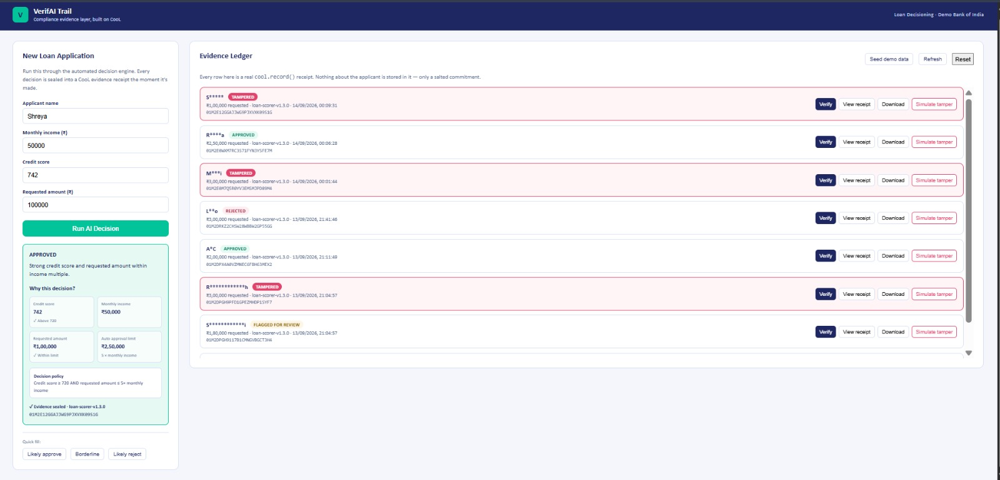
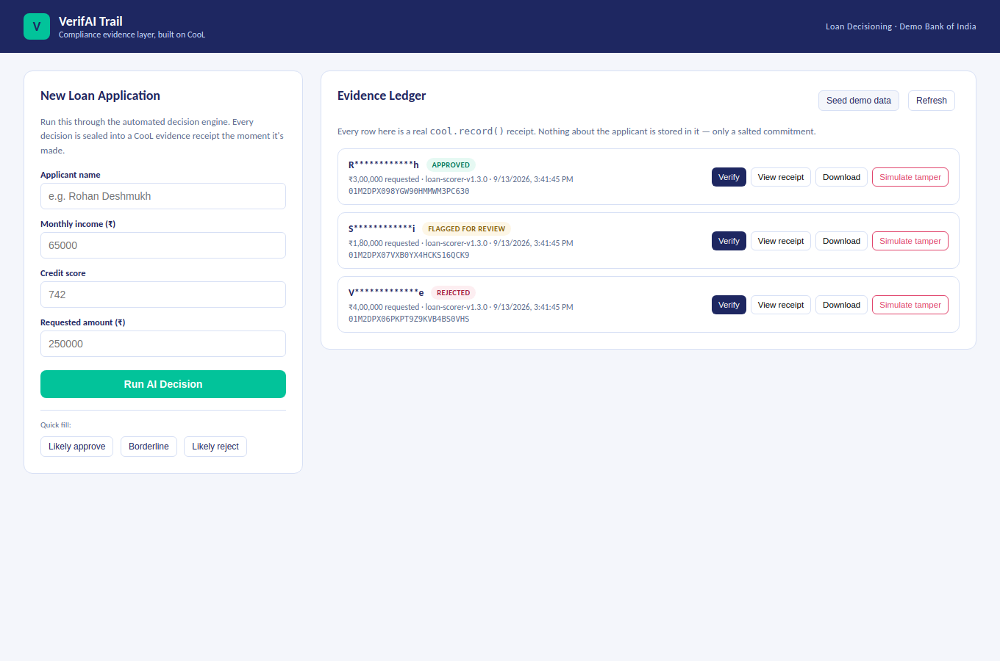
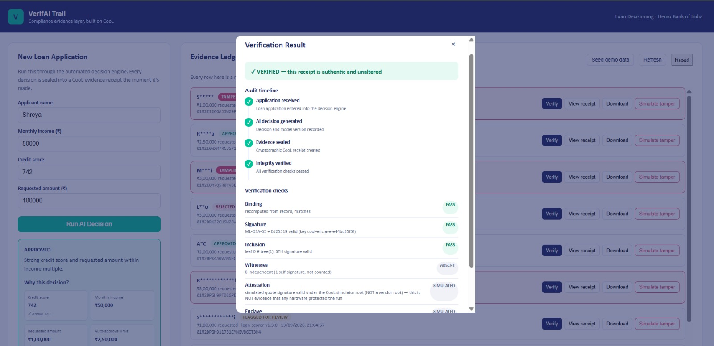
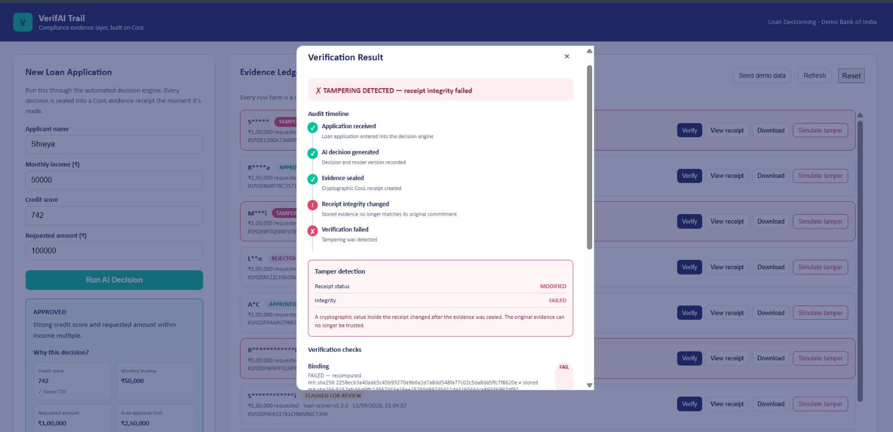
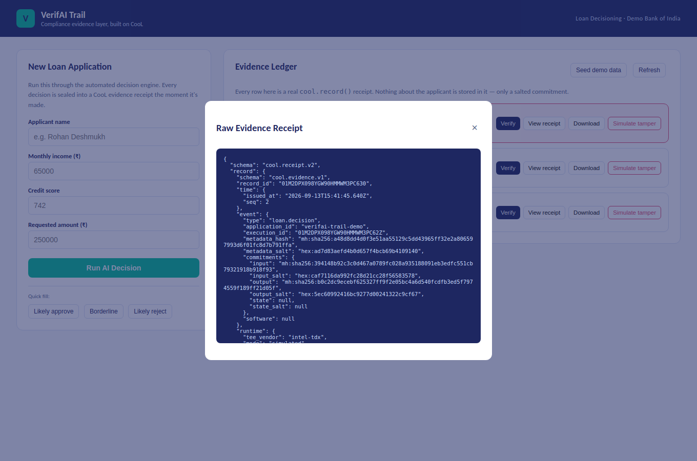

<div align="center">

# VerifAI Trail

### *A compliance evidence layer for AI-driven lending decisions in Indian BFSI*

**Prove what an AI decision actually was — without ever storing the data behind it.**

[](https://github.com/Northwind-Cipher/cool-sdk)
[](https://nodejs.org)
[](https://www.mongodb.com/atlas)
[](https://verifai-trail.vercel.app/)
[](https://csrc.nist.gov/pubs/fips/204/final)
[](./LICENSE)

**[🔴 Live Demo](https://verifai-trail.vercel.app/) &nbsp;·&nbsp; [📦 Source](https://github.com/amruta7974/verifai-trail) &nbsp;·&nbsp; [🛠️ CooL SDK](https://github.com/Northwind-Cipher/cool-sdk)**

</div>

---

## Table of contents

- [The problem](#the-problem)
- [What we built](#what-we-built)
- [See it work](#see-it-work)
- [The Evidence Ledger](#the-evidence-ledger)
- [Explainable decision results](#explainable-decision-results)
- [Audit timeline](#audit-timeline)
- [Tamper detection](#tamper-detection)
- [How the CooL SDK is used — and why it's essential](#how-the-cool-sdk-is-used--and-why-its-essential-not-decorative)
- [Why MongoDB](#why-mongodb)
- [Architecture](#architecture--workflow)
- [Technical decisions](#technical-decisions-worth-knowing)
- [Limitations & future work](#limitations-and-future-improvements)
- [Run it locally](#running-it-locally)
- [Deploy your own](#deploying-to-vercel)

---

## The problem

AI now approves loans, flags fraud, and triages claims across Indian BFSI. Regulators — RBI's **FREE-AI framework** (Aug 2025) — are moving toward requiring audit trails and independent validation for these decisions, and several of its provisions are proposed for incorporation into binding RBI Master Directions. At the same time, the **DPDP Act 2023** restricts how long personal data can be retained.

Most companies can only satisfy one side of that at a time: keep detailed logs (a privacy and breach-liability risk), or keep clean data (no audit trail to show a regulator or a disputing customer). Ordinary application logs don't solve this either way — a log line can be edited after the fact, and a screenshot proves nothing about what a model actually did.

**VerifAI Trail exists to close that gap: prove the decision, discard the data.**

## What we built

A loan-decisioning demo with a real compliance dashboard on top — not a mockup, a working system:

1. A rule-based loan decision engine approves, rejects, or flags applications for manual review, and returns the exact reasoning behind that outcome.
2. The moment a decision is made, it's sealed with `cool.record()` — the applicant's actual data (name, income, credit score, the decision output) is committed as a **salted hash and discarded**. Only the hash and a signed receipt persist; the plaintext never touches storage.
3. A compliance dashboard (**Evidence Ledger**) lists every decision by a masked applicant ID, with a **Verify** button that runs the real CooL verifier and shows its full **7-domain verdict** (binding, signature, inclusion, witnesses, attestation, enclave, anchor) — not a single fake green tick.
4. An **Audit Timeline** on every decision shows the full lifecycle — received, decided, sealed, verified — so evidence is presented as a chain of events, not just a final status.
5. A **Simulate tamper** button flips one hex digit in the stored receipt — exactly like CooL's own tamper demo — and re-verifying immediately flips the timeline and the verdict to `FAILED`, with the exact cryptographic reason.
6. **View receipt** / **Download** show or export the raw `cool.receipt.v2` JSON — the artifact an auditor or regulator would actually be handed.
7. **Seed demo data** instantly creates one of each outcome, for a fast, typo-free live demo.
8. Backed by **MongoDB Atlas**, so the Evidence Ledger survives restarts, cold starts, and redeploys — not an in-memory array that resets on you.

## See it work

<table>
<tr>
<td width="50%">

**The dashboard**


</td>
<td width="50%">

**Every row is a real CooL receipt**


</td>
</tr>
<tr>
<td width="50%">

**The real 7-domain verdict**


</td>
<td width="50%">

**Tamper one hex digit → verification fails**


</td>
</tr>
</table>

**The raw receipt — zero applicant PII, provably:**


## The Evidence Ledger

Every decision the engine makes becomes one entry in the Evidence Ledger. Each row surfaces exactly what a compliance reviewer needs, and nothing else:

| Field | Purpose |
| --- | --- |
| Masked applicant identity | Identifies the record without exposing PII |
| Decision outcome | Approved / Review / Rejected |
| Model / version metadata | Which decision logic produced this outcome |
| Timestamp | When the decision was made |
| Evidence status | Whether a signed receipt exists for this decision |
| Verification controls | One-click, on-demand cryptographic re-verification |
| Tamper status | Whether the underlying receipt has been altered since sealing |

The ledger is deliberately a *summary* view — it never exposes the applicant's raw financial information just to provide an audit trail. Full evidence (the signed receipt) is only fetched and decoded on demand, when a reviewer explicitly asks for it.

## Explainable decision results

A verdict is only useful if it comes with a reason. Every decision on the ledger records the inputs that actually drove the outcome, alongside the outcome itself:

- Credit score
- Income
- Requested amount
- Auto-approval limit
- Decision policy applied

This is what turns *"the AI rejected this application"* into something a compliance officer or a disputing customer can actually be shown: which threshold was checked, what value was compared against it, and which policy fired as a result — all sealed into the same receipt as the decision, so the explanation can never drift from the evidence after the fact.

## Audit timeline

VerifAI Trail makes the lifecycle of a decision visible, not just its final status. A normal decision moves through four explicit stages:

```
✓ Application received
        ↓
✓ AI decision generated
        ↓
✓ Evidence sealed
        ↓
✓ Integrity verified
```

Compliance evidence isn't just a final result — it's a chain of events showing *what* happened, *when* it happened, and *whether the resulting evidence is still intact*. If tampering occurs, the timeline changes visibly and immediately:

```
✓ Application received
✓ AI decision generated
✓ Evidence sealed
!  Receipt integrity changed
✗  Verification failed
```

A reviewer never has to interpret a status code — the timeline itself tells the story of a normal decision versus a compromised evidence artifact.

## Tamper detection

This is the core demonstration of VerifAI Trail.

Once a receipt exists, the dashboard exposes a single button: **Simulate tamper**. It modifies one hexadecimal character inside the stored evidence receipt — nothing else about the underlying decision changes. The receipt is then re-verified, and the result is unambiguous:

```
✗ TAMPERING DETECTED

AUDIT TIMELINE
✓ Application received
✓ AI decision generated
✓ Evidence sealed
!  Receipt integrity changed
✗  Verification failed

TAMPER DETECTION
Receipt status    MODIFIED
Integrity         FAILED
```

The point isn't that a demo button can edit a database value — any database allows that. The point is that the cryptographic verification layer *independently detects* that the evidence artifact no longer matches what was originally sealed, and shows exactly where and why. That turns tampering from a theoretical audit concern into something a judge can watch happen, live, in under ten seconds.

## How the CooL SDK is used — and why it's essential, not decorative

CooL isn't bolted on as an afterthought; it's the entire mechanism that makes the pitch true:

| Round-1 claim | CooL feature that actually delivers it |
| --- | --- |
| "Prove a decision wasn't altered after the fact" | `cool.record()`'s binding hash + hybrid **ML-DSA-65 + Ed25519** signature over canonical CBOR — this is what `verifyEvidence()` checks, and what `/api/tamper/:id` demonstrably breaks |
| "Prove which model/version ran" | The `metadata` passed to `record()` (model name, version, decision, decision inputs) is committed and signed as part of the receipt |
| "Never store the customer's actual data" | Every `payloads` value (the applicant's raw input/output) is committed as a **salted SHA-256 hash and discarded** by the SDK itself — we never see plaintext again after the `record()` call returns |
| "Nothing was quietly deleted or inserted into the log after the fact" | The **RFC 6962 transparency log** + inclusion proof, checked under `inclusion` in every verdict |
| "Anyone can check this independently, without trusting us" | `verifyEvidence()` runs entirely **offline** against the receipt JSON — no CooL account, no network call, no access to our database |

Without CooL, this app would just be a rule-based loan approver with a normal, editable database row per decision — exactly the unprovable status quo the pitch argues is the problem. CooL is what turns *"trust us"* into *"check for yourself."*

## Why MongoDB

The Round 1 in-memory version lost every decision on restart — fine for a local demo, but it breaks completely on a serverless platform like Vercel, where a fresh function instance can spin up for any request. MongoDB Atlas gives the Evidence Ledger actual persistence: decisions and their receipts survive restarts, cold starts, and redeploys, the way a real compliance record store would need to.

**What MongoDB is *not* used for:** it never stores the applicant's raw data. It stores exactly what the CooL receipt already exposes — masked applicant labels, decision outcomes, the explainable decision inputs, and the signed evidence JSON (itself already scrubbed of plaintext by CooL). The privacy property comes from CooL's `record()` call, not from anything done at the database layer.

## Architecture / workflow

```
                     ┌─────────────────────┐
   POST /api/decide  │   Express app        │
   ───────────────▶  │   (api/index.js)     │
                     │                      │
                     │  1. decide()         │  rule-based approve / review / reject
                     │  2. cool.record()    │  ← CooL SDK: commit + sign + (simulated) attest
                     │  3. db.insertOne()   │  ← MongoDB: persist the receipt + metadata
                     └─────────┬────────────┘
                               │
                     ┌─────────▼────────────┐
                     │   MongoDB Atlas       │  decisions collection:
                     │   (decisions coll.)   │  { id, applicant(masked), decision, reasoning,
                     └─────────┬────────────┘    model, timestamp, evidence, tampered }
                               │
   GET /api/decisions          │
   POST /api/verify/:id  ──────┤  verifyEvidence(evidence) → 7-domain verdict
   POST /api/tamper/:id  ──────┤  flips one hex digit, re-persists, next verify fails
   GET  /api/receipt/:id ──────┘  returns the raw cool.receipt.v2 JSON

                     ┌──────────────────────┐
   Browser  ◀────────│  /public (static)     │  dashboard UI — Evidence Ledger, Audit
                     │  index.html/app.js/   │  Timeline, tamper controls — served
                     │  styles.css           │  directly by Vercel's static hosting
                     └──────────────────────┘
```

`vercel.json` rewrites only `/api/(.*)` into the single serverless function at `api/index.js`; everything else (`/`, `/app.js`, `/styles.css`) is served as a static asset directly by Vercel.

## Technical decisions worth knowing

- **Single Express app as one serverless function**, not one function per route — simpler to reason about, and avoids paying a MongoDB connection-pool cost per route on Vercel's per-file function model.
- **Cached MongoDB connection at module scope** (`api/db.js`) rather than opening a new `MongoClient` per request — required on serverless, where a warm function instance should reuse its connection rather than exhausting Atlas's connection limit.
- **Projection on `GET /api/decisions`** explicitly excludes the `evidence` field so the ledger list stays small; the full receipt is only fetched on demand via `/api/receipt/:id`.
- **Decision reasoning is computed once, at decision time**, and sealed into the same receipt as the outcome — so the explanation shown on the ledger can never drift from what was actually signed.
- **The decision engine is deliberately simple** (single credit-score threshold) — the point of this build is the evidence layer, not a realistic underwriting model.
- **Attestation and enclave checks report `simulated`**, because this doesn't run inside a real Intel TDX enclave (that needs Phala's `dstack` and real confidential-computing hardware). CooL is explicit about this in its own verdicts — it never reports `pass` on a check it can't actually perform, and neither does this app's UI.
- **`engines.node: "22.x"`** pinned exactly in `package.json` — Vercel requires an exact major version for Serverless Functions rather than an open range, and `cool-nwc` requires Node ≥ 20.

## Limitations and future improvements

- **No authentication** — anyone with the URL can see the Evidence Ledger. A real deployment needs role-based access (only compliance officers can view; only the decision engine's service account can write).
- **No real TEE attestation** — deploying the evidence-generation step inside a `dstack` TDX enclave would turn the `attestation`/`enclave` verdict checks from `simulated` to `pass`, closing the last gap in the "was this run in an approved environment" claim.
- **Decision engine is a toy** — a real deployment would call an actual underwriting model, with `cool.record()` wrapping its real input/output and reasoning rather than a synthetic rule.
- **No independent transparency witnesses** — the RFC 6962 log's signed tree head is self-signed by this deployment; production would want external witnesses/gossip so the log's own operator can't quietly rewrite history either.
- **Single MongoDB collection, no indices** — fine at demo scale; production would add an index on `id` and a TTL/archival policy for old receipts.
- **No pagination** on `/api/decisions` — fine for a demo, would need it at real volume.

## Running it locally

```bash
git clone https://github.com/amruta7974/verifai-trail.git
cd verifai-trail
npm install
cp .env.example .env   # then fill in your MongoDB Atlas connection string
npm start
```

Open `http://localhost:4000`. Use **Seed demo data**, or the three **Quick fill** presets, to generate approve/review/reject scenarios without typing numbers by hand.

### MongoDB setup (free, ~5 minutes)

1. Create a free cluster at [MongoDB Atlas](https://www.mongodb.com/cloud/atlas/register).
2. Under **Database Access**, create a user with a password.
3. Under **Network Access**, allow access from anywhere (`0.0.0.0/0`) — fine for a hackathon demo.
4. Under **Connect → Drivers**, copy the connection string into `.env` as `MONGODB_URI`.

## Deploying to Vercel

1. Push this repo to GitHub (already done — see [source](https://github.com/amruta7974/verifai-trail)).
2. On [vercel.com](https://vercel.com) → **Add New → Project** → import the repo.
3. Vercel auto-detects the `/api` function and `/public` static folder — no build command needed.
4. Under **Settings → Environment Variables**, add `MONGODB_URI` (and optionally `MONGODB_DB`).
5. Deploy. You'll get a `https://your-app.vercel.app` URL that works exactly like local dev, with persistence backed by Atlas instead of memory.

## Files

```
verifai-trail/
├── api/
│   ├── index.js     # Express app — decision engine, all CooL SDK calls, all MongoDB reads/writes
│   └── db.js         # Cached MongoDB connection helper
├── public/
│   ├── index.html     # Compliance dashboard shell — Evidence Ledger + Audit Timeline
│   ├── app.js          # Dashboard logic — no framework, no build step
│   └── styles.css      # Navy/teal design system
├── docs/screenshots/   # README assets
├── vercel.json          # Routes /api/* to the function; everything else is static
└── .env.example
```

---

<div align="center">

Built solo for the **Reverse Hackathon 2026**, on top of Northwind Cipher's [CooL SDK](https://github.com/Northwind-Cipher/cool-sdk).

</div>